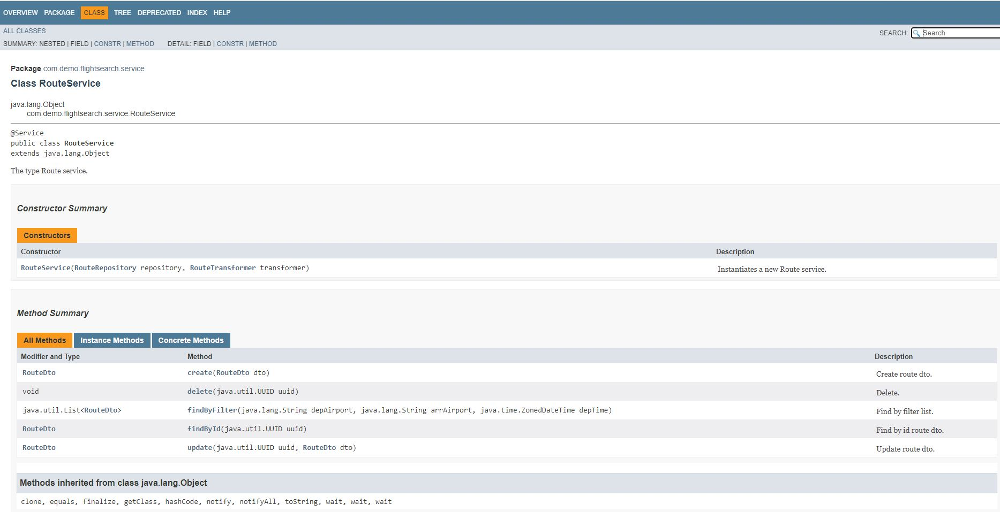

# Flight Search with Java 11,Spring Boot and Docker Compose
> This demo application helps to calculate the cheapest flights.
> 
> This application supports two user groups, Managers who can add/modify/delete flight routes
> and Users who can search flights and get the cheapest available options including interconnected flights.


## Table of contents
* [Technologies](#technologies)
* [Setup](#setup)
* [Features](#features)
* [Examples](#examples)
* [Screenshots](#screenshots)
* [Contact](#contact)

## Technologies
* Java -           version 11.0.10
* SpringBoot -     version 2.4.5
* Docker-Compose - version 1.29.0
* PostgreSQL - 13.1

## Setup
* Running the application.
  * Navigate to src/main/docker and run `docker-compose up`


* Running the ITs.
  * IT's can be directly run in IDE and they will automatically spin up the test DB containers and run. Easy peasy :) 
    

* Re-building the application if there are changes done.
   * `flight-search>mvn clean install -DskipTests`
* Copy flight-search-0.0.1-SNAPSHOT.jar from target to src/main/docker
   * `cp target/flight-search-0.0.1-SNAPSHOT.jar src/main/docker`
* Remove the old image and redeploy with the new one
   * `cd src/main/docker`
     
     `docker-compose down`
     
     `docker rmi docker-flight-search:latest`
     
     `docker-compose up`
     `

## Features
List of features.
* Docker compose is used to spin up two containers, one for app and one for postgres db instance.(https://docs.docker.com/compose/)
* DB migrations are done using Liquibase (https://www.liquibase.org/)
* Integration tests are run using test containers(https://www.testcontainers.org/) and same liquibase scripts are used to create test schema
    there by ensuring test database and production database schema are same, which aids in effective testing.
* Swagger is integrated and once the application is up in local details can be viewed at http://localhost:8080/flight-search/swagger-ui/#/
* Application javadoc can be found by opening `javadoc/index.html` in browser.

To-do list:
* Only supports basic auth for now, can be extended to support nicer aunthentication/authorization paradigms.

## Examples
* This demo app uses basic authentication, and two users who are configured can be found in
  [Here](src/main/java/com/demo/flightsearch/config/SecurityConfig.java)
* Using one of the users above call the search-flights api
>`http://localhost:8080/flight-search/search-flights?depAirportCode=TOR&arrAirportCode=BLR&departureDate=2021-01-01T00:00:00Z&arrivalDate=2021-01-02T23:00:00Z&maxConnections=3&maxResults=1`
* As sample test data is already setup [Here](src/main/resources/database/scripts/initial-database-creation.sql)
* Response to the above API request will be as follows.
> ```json
>  [
>    {
>        "uuid": "1196df67-4078-4aa3-bcb3-384f4badc67d",
>        "itinerary": [
>            {
>                "uuid": "5c8bb7ea-5b9a-aa5a-2f11-7fdccfc00001",
>                "airlineCode": "CP ",
>                "departureAirportCode": "TOR",
>                "arrivalAirportCode": "BER",
>                "departureDate": "2021-01-01T06:00:00Z",
>                "arrivalDate": "2021-01-01T15:45:00Z",
>                "costInEuro": 700.0
>            },
>            {
>                "uuid": "5c8bb7ea-5b9a-aa5a-2f11-7fdccfc00003",
>                "airlineCode": "TA ",
>                "departureAirportCode": "BER",
>                "arrivalAirportCode": "DOH",
>                "departureDate": "2021-01-01T18:00:00Z",
>                "arrivalDate": "2021-01-02T04:00:00Z",
>                "costInEuro": 350.0
>            },
>            {
>                "uuid": "5c8bb7ea-5b9a-aa5a-2f11-7fdccfc00004",
>                "airlineCode": "SA ",
>                "departureAirportCode": "DOH",
>                "arrivalAirportCode": "BLR",
>                "departureDate": "2021-01-02T06:00:00Z",
>                "arrivalDate": "2021-01-02T13:30:00Z",
>                "costInEuro": 300.0
>            }
>        ],
>        "totalCostInEuro": 1350.0
>    }
>]
> ```
## Screenshots

* Swagger integration


* Javadocs


  
## Contact
Created by [@PratikMulgund](https://de.linkedin.com/in/pratikmulgund) - feel free to contact me!
